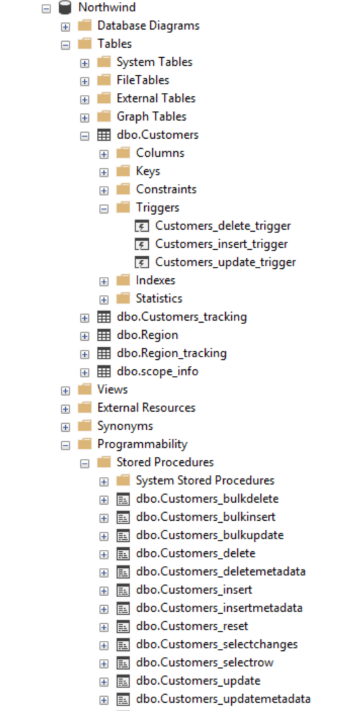

# Provision and Deprovision

## Introduction

First of all, you have to know that provisionning is basically automatic and managed for you by the **Dotmim.Sync** framework.   

When you launch for the first time a sync process, the **Dotmim.Sync** will:
* Get schemas from the server database.
* Create all the stuff needed to be able to sync on the server side : Stored procedures, triggers and tracking tables.
* Generate a `SyncConfiguration` object passed to each client.
* If necessary, create all the tables on the client.
* Then create all the stuff needed to be able to sync on the client : Stored procedures, triggers and tracking tables

### Automatic provisionning sample

Basically, we have a simple database containing two tables *Customers* and *Region*:


And here the most straightforward code to be able to sync a client db :

```csharp
SqlSyncProvider serverProvider = new SqlSyncProvider(GetDatabaseConnectionString("Northwind"));
SqlSyncProvider clientProvider = new SqlSyncProvider(GetDatabaseConnectionString("NW1"));

SyncAgent agent = new SyncAgent(clientProvider, serverProvider, new string[] {
"Customers", "Region"});

var syncContext = await agent.SynchronizeAsync();

Console.WriteLine(syncContext);

```

Once your sync process is finished, you will have a full configured database :



## Manually provisionning

In some circumstances, you may want to provision manually your database (server or client as well).  
* If you have a really big database, the provision step could be really long, so it could be better to provision the server side before any sync process.
* If you have to modify your schema. You will have to *deprovision* then *edit* your schema then *provision* again your database.

That's why the **Dotmim.Sync** framework contains several methods to let you control how, and when, you want to provion and deprovision your database.

Each provider (inheriting from `CoreProvider`) has two main methods, basically:
* `ProvisionAsync(string[] tables, SyncProvision provision)`
* `DeprovisionAsync(string[] tables, SyncProvision provision)`

the `SyncProvision` enum parameter lets you decide which kind of objects (tables, stored proc, triggers or tracking tables) you will provision on your target database.

```csharp
[Flags]
public enum SyncProvision
{
    Table = 1,
    Triggers = 2,
    StoredProcedures = 4,
    TrackingTable = 8,
    All = 16
}

```
For instance, here is the code you need to provision a database :

```csharp
SqlSyncProvider serverProvider = new SqlSyncProvider(GetDatabaseConnectionString("Northwind"));

// tables to provision
var tables = new string[] { "Customers", "Region" };

// Stored procedures, tracking tables and triggers
await clientProvider.ProvisionAsync(tables, SyncProvision.StoredProcedures | SyncProvision.TrackingTable | SyncProvision.Triggers);
```

## Manually Deprovision

Like provisioning, deprovisioning uses basically the same method :

```csharp
SqlSyncProvider serverProvider = new SqlSyncProvider(GetDatabaseConnectionString("Northwind"));

// tables to provision
var tables = new string[] { "Customers", "Region" };

// Stored procedures, tracking tables and triggers
await clientProvider.DeprovisionAsync(tables, SyncProvision.StoredProcedures | SyncProvision.TrackingTable | SyncProvision.Triggers);

```
**Be careful**, if you specify `SyncProvision.All`, **all* your database schema will be deleted (even your base tables). 

## Managing a database migration

During any dev cycle, you will probably have to make some evolutions on your server database.  
Adding or deleting columns will break the sync process.  
Manually, without the `Provision()` and `Deprovision()` methods, you will have to edit all the stored procedures, triggers and so on to be able to recreate a full sync processus.  

Now imagine you want to add new column, called `Comments` on the `Customers` table.   
Here is how you could handle it:

* Create the providers.
* Delete the stored procédures and the triggers.
* We don't want to loose the `Customers` tracking table, to keep the sync historic, so we don't delete it. Here we have to be sure the primary keys from `Customers` is still the same (So don't touch primary keys or this technic won't work)
* Edit the client and server schema (you can use here the EF migration)
* Re apply the triggers and the stored procédures. They will be re-generated with the new column !
* Re launch a new sync process (don't use the same `SyncAgent` as before, recreate a new one).

``` cs
private static async Task AlterSchemasAsync()
{
    SqlSyncProvider serverProvider = new SqlSyncProvider(GetDatabaseConnectionString("Northwind"));
    SqlSyncProvider clientProvider = new SqlSyncProvider(GetDatabaseConnectionString("NW1"));

    // tables to edit
    var tables = new string[] { "Customers" };

    // delete triggers and sp
    await serverProvider.DeprovisionAsync(tables, SyncProvision.StoredProcedures | SyncProvision.Triggers);
    await clientProvider.DeprovisionAsync(tables, SyncProvision.StoredProcedures | SyncProvision.Triggers);

    // use whatever you want to edit your schema
    // add column on server
    using (SqlConnection cs = serverProvider.CreateConnection() as SqlConnection)
    {
        cs.Open();
        SqlCommand cmd = new SqlCommand("ALTER TABLE dbo.Customers ADD Comments nvarchar(50) NULL", cs);
        cmd.ExecuteNonQuery();
        cs.Close();
    }
    // add column on client
    using (SqlConnection cs = clientProvider.CreateConnection() as SqlConnection)
    {
        cs.Open();
        SqlCommand cmd = new SqlCommand("ALTER TABLE dbo.Customers ADD Comments nvarchar(50) NULL", cs);
        cmd.ExecuteNonQuery();
        cs.Close();
    }

    // Provision again
    await serverProvider.CreateSyncTablesAsync(tables, SyncProvision.StoredProcedures | SyncProvision.Triggers);
    await clientProvider.CreateSyncTablesAsync(tables, SyncProvision.StoredProcedures | SyncProvision.Triggers);

  // sync !
  await this.SynchronizeAsync();
}
```


